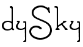

#
**dySky** is a novel technique for processing Skyline queries in presence of data with partially and dynamically ordered attributes. Its main algorithm decomposes queries into a set of independent sub-queries, each of which operates on a subset of the data. 

This repository contains **dySky** sources together with its main competitors sources.

### Repository organization

The repository is organized as follows:

* state of the art algorithms sources: BSkyTree/, CPS/, OST/, Ref/

* data generator: generator/

* dySky sources: dySky/

* common files: 

  * common/: common sources for all algorithms
  * main.cpp: main file and contains algorithms selection.
  * makefile: compiling source
  * run.sh: to define the experiment parameters and execute it
  
### Running an Experiment

First, compiling the source code requires:

* g++ compiler
* OpenMP API

Then,

1. Clone and Compile the code 

```shell 
git clone https://github.com/karimalami7/dySky.git
cd dySky
make
```
2. Define the parameters in run.sh (parameters are explained inside the file)

3. Select the Algorithms in main.cpp (compile again if changes made)

4. Run 

```shell 
./run.sh
```
